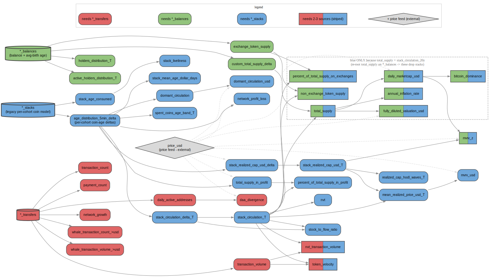

# On-chain metrics → source-table dependency map

**Date:** 2026-06-03
**Author:** Yordan + Claude analysis session
**Repo context:** `clickhouse-tables` (Daily Metrics Framework)
**Companion:** `santiment-cheatsheets/claude-analysis/stack-circulation-and-realized-price-on-average-balance-age.md` — *why* realized/age metrics need a coin model at all.

**Question:** If we deprecate the legacy per-coin `*_stacks` table, **which metrics break?** This map colors every on-chain metric by the raw source it (transitively) needs, so the blast radius of dropping `_stacks` is visible at a glance.



> View interactively: `xdot metrics_map.dot` (`sudo apt install xdot`), or open `metrics_map.svg` in a browser.

---

## 1. Background — the three sources and what each can express

We are comparing three ClickHouse source tables (schemas confirmed on `clickhouse.production.san`, ERC20 family shown; every chain has its own `{chain}_{transfers,balances,stacks}`):

| Source | Key columns | What it encodes about a holding's **age / acquisition price** |
|---|---|---|
| `*_transfers` | `dt, from, to, value` | **Nothing.** A bare scalar `value` moves; an outflow carries no info about *when / at what price* the leaving coins were acquired. |
| `*_balances` | `balance, oldBalance, averageBalanceBirthTimestamp, odt` | **One average** birth-timestamp per address (the "tank" model). |
| `*_stacks` | `sign, dt, odt, amount, address, nonce` | **Full per-cohort** `(odt → amount)` slices per address (LIFO coin model). The table we want to retire. |

The companion doc establishes the core result: **realized-price / coin-age metrics are a property of the *stock* (coins currently held + their provenance), not the *flow***. Reconstructing an outflow's acquisition price/age requires per-address state + an attribution convention — which is exactly what `*_stacks` (per-cohort) and `*_balances` (single average) provide, and what `*_transfers` cannot. UTXO chains are the exception (a spend names the consumed output natively), but our account-based transfer tables don't carry it.

So the map's colors are really "**which attribution model does this metric ride on?**"

- 🟥 **red** = needs `*_transfers`
- 🟩 **green** = needs `*_balances`
- 🟦 **blue** = needs `*_stacks` (legacy coin model)
- **striped** = needs 2–3 sources at once
- ◇ **grey diamond** = price feed (external; not a coin-data source — drawn only for honesty on `*_usd` metrics)

Edges point **dependency → dependent**.

---

## 2. How the map was derived

### 2.1 Dependency edges — from the specs
The Daily Metrics Framework declares each metric's inputs in `daily_metrics/specs.d/metrics/**/*.yaml` under `spec.dependsOn` (and `spec.formula` for `type: composite`). We parse all of them with PyYAML into a directed graph:

- **1907** metric specs (**361** carry a composite `formula`), **664** graph leaves.
- Strip the version suffix (`stack_circulation_1d/2019-01-01` → `stack_circulation_1d`).
- Collapse window/bucket suffixes so siblings merge into one conceptual node:
  `_1d … _20y` → `_T`, distribution buckets `1e1 … 1e9 / all / inf` → `_B`.

`extract_source_map.py` does this and prints the full result. Example verified chains:

```
stack_circulation_T            <- stack_circulation_delta_T <- age_distribution_5min_delta
mean_realized_price_usd_T      <- stack_circulation_T , stack_realized_cap_usd_T
stack_realized_cap_usd_T       <- stack_realized_cap_usd_delta <- age_distribution_5min_delta
mvrv_usd                       <- daily_closing_price_usd , mean_realized_price_usd_T
nvt_transaction_volume         <- stack_circulation_20y , transaction_volume
total_supply                   <- custom_total_supply_delta , stack_circulation_20y     # <- the pivot
daily_marketcap_usd            <- daily_closing_price_usd , total_supply
token_velocity                 <- stack_circulation_T , transaction_volume
```

### 2.2 Leaf → source coloring — from the jobs
Graph **leaves** (no `dependsOn`) are produced directly by source-reading jobs. The decisive one:

```
age_distribution_5min_delta
   produced by job_functions/distribution_deltas.py
   which reads config 'distribution_deltas_table'  (default 'distribution_deltas_5min')
   built from *_stacks  (eth_stacks / erc20_stacks)            -> BLUE today
   after the stacks->age-balances migration: backed by age_balances_base.py -> would be GREEN
```

So **the entire blue subtree roots at this single node** — it is the migration pivot.

Other leaf families (by producing-job source table / metric semantics):
- 🟥 transfers: `transaction_volume`, `transaction_count`, `payment_count`, `daily_active_addresses`, `network_growth`, `whale_transaction_*`
- 🟩 balances: `holders_distribution_*`, `active_holders_distribution_*`, `exchange_token_supply`, `custom_total_supply_delta`
- ◇ price: `price_usd`, `daily_*_price_usd`, `*_marketcap_usd`

### 2.3 Color propagation
Each metric's color set = the union of the source colors of every leaf it can transitively reach. A node with >1 color is rendered striped (`build_metrics_map.py`, Graphviz `style="striped,filled"`).

> ⚠️ **Caveat baked into the method:** `dependsOn` is *not* complete for source attribution. A few base metrics (`realized_value_usd`, `realized_profit`, `address_profit`) are computed directly by jobs that read the coin-age source without declaring it — they appear as uncolored leaves here but are effectively blue. Always classify a leaf by its *producing job's* source table, not by `dependsOn` alone.

---

## 3. Key findings

1. **One pivot.** Every blue metric hangs off `age_distribution_5min_delta`, the sole `*_stacks` reader. Re-point it at `age_balances` and the whole blue tree migrates at once.

2. **`total_supply` is blue *by wiring*, not by nature.** It's computed as `stack_circulation_20y` (all-time circulation = total held supply). That single edge drags `daily_marketcap_usd → fully_diluted_valuation_usd / bitcoin_dominance / annual_inflation_rate`, plus `non_exchange_token_supply` and `percent_of_total_supply_on_exchanges`, into the blue set (the dashed cluster in the map). All-time supply is the **convention-free** quantity (just a balance sum), so re-rooting `total_supply` on `*_balances` removes `_stacks` from all of these for free.

3. **The truly stacks-essential set** (pure blue, *not* in the pivot cluster) is the per-cohort-age family:
   `stack_circulation_T`, `stack_realized_cap_usd_T`, `mean_realized_price_usd_T`, `mvrv_usd`,
   `dormant_circulation`, `spent_coins_age_band_T`, `realized_cap_hodl_waves_T`, `stack_liveliness`,
   `stack_mean_age_dollar_days`, `network_profit_loss`, `total_supply_in_profit`, `nvt`, `stock_to_flow_ratio`.
   These genuinely need per-cohort age. Per the companion doc, the **time-bounded** ones cannot be reproduced faithfully on the single-average `*_balances` tank (step-function circulation, flattened term structure) — they are the real casualties of dropping `_stacks` without per-cohort age.

4. **Multi-source metrics** (striped): `token_velocity` & `nvt_transaction_volume` (blue+red, mix coin-age with `transaction_volume`); `mvrv_z` (blue+green, via marketcap).

5. **Scale:** the full machine-extracted blue set is **129 canonical metrics** (389 before window-collapsing). The rendered map is a curated **42-node** view of the headline families; run `extract_source_map.py` for the exhaustive list.

---

## 4. Files & reproduction

| File | What it is |
|---|---|
| `onchain-metrics-source-map.md` | this document |
| `metrics_map.dot` | the graph definition (human-readable Graphviz) |
| `metrics_map.svg` | rendered view (`.png` renders live in `santiment-cheatsheets/claude-analysis/onchain-metrics-source-map/`, not committed here) |
| `build_metrics_map.py` | regenerates `metrics_map.dot` (curated nodes/edges/colors, hand-encoded from the verified spec extraction) |
| `extract_source_map.py` | re-derives the dependency graph + full stacks-dependent set straight from repo specs; use to refresh when specs change |

```bash
# regenerate the curated map
python3 build_metrics_map.py
dot -Tsvg metrics_map.dot -o metrics_map.svg      # or -Tpng -Gdpi=130
xdot metrics_map.dot                              # interactive

# re-derive / verify from the repo (run inside clickhouse-tables/)
python3 extract_source_map.py                     # summary + full blue set
python3 extract_source_map.py mvrv_usd total_supply token_velocity   # parents of specific metrics
```

---

## 5. Confidence & caveats

- **High** — blue (`*_stacks`) lineage and the `total_supply = stack_circulation_20y` pivot: spec-verified, plus the `age_distribution → distribution_deltas_5min → *_stacks` path confirmed in job code.
- **High** — red/green leaf families by metric semantics (textbook transfers- vs balances-derived), though not every leaf's `source_table()` call was grep-verified.
- **Medium** — `custom_total_supply_delta → green`: assumed to be a supply/balance feed (not code-verified).
- **Scope** — curated to the headline on-chain families. DeFi-protocol / social / NFT / derivatives metrics are excluded; note that DeFi `*_usd` metrics inherit blue indirectly via `total_supply`/`marketcap` until that pivot is re-rooted.
